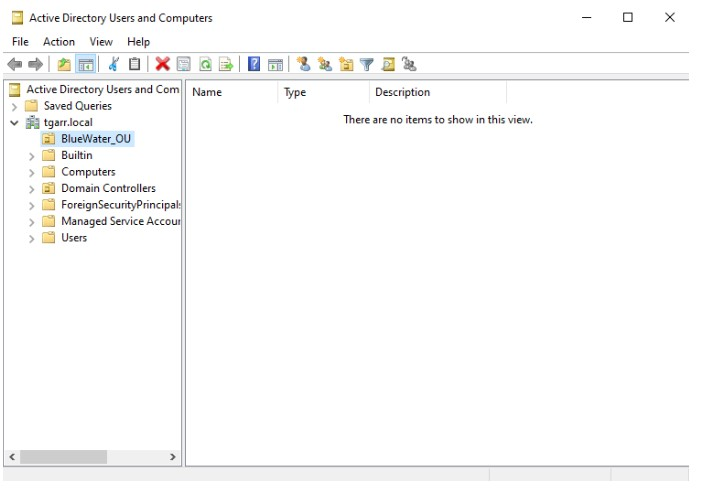
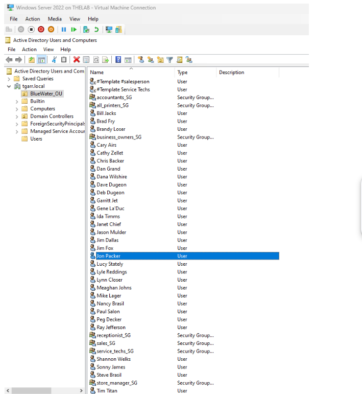
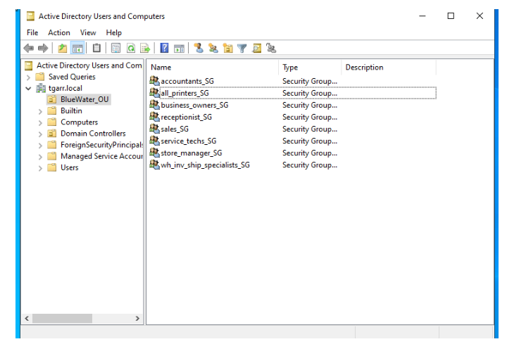
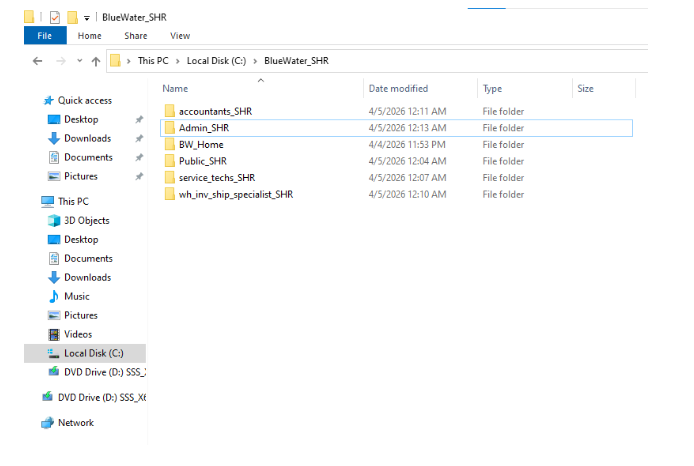
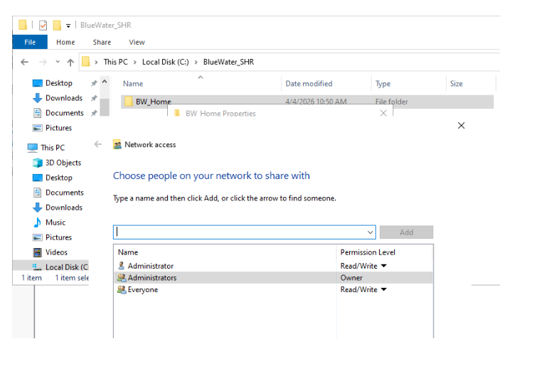

# active-directory-lab
Built a Windows Server 2022 Active Directory environment with domain controller in Hyper-V, client machine, and Group Policy configuration.

## Environment
- Windows Server 2022 (Domain Controller - DC01)
- Windows 10 (Client Machine - PC01)
- Hyper-V Virtualization
- Domain: tgarr.local

- ## Objectives
- Deploy Active Directory Domain Services (AD DS)
- Configure a Domain Controller
- Implement user and group management
- Apply Group Policy for security control
- Join client machine to domain

- ## Steps Performed
1. Installed Windows Server 2022 on DC01
2. Configured static IP and DNS
3. Installed AD DS role
4. Promoted server to Domain Controller
5. Created domain (tgarr.local)
6. Created Organizational Units (OUs)
7. Added users and security groups
8. Configured Group Policy Objects (GPOs)
9. Joined Windows 10 client (PC01) to domain
10. Verified authentication and policy application

11. ## Screenshots

## Security Concepts Demonstrated
- Identity and Access Management (IAM)
- Least Privilege Principle
- Group Policy Enforcement
- Centralized Authentication (Kerberos)

## Skills Demonstrated
- Windows Server Administration
- Active Directory Configuration
- Network Configuration (DNS, Domain Join)
- Troubleshooting and System Deployment

